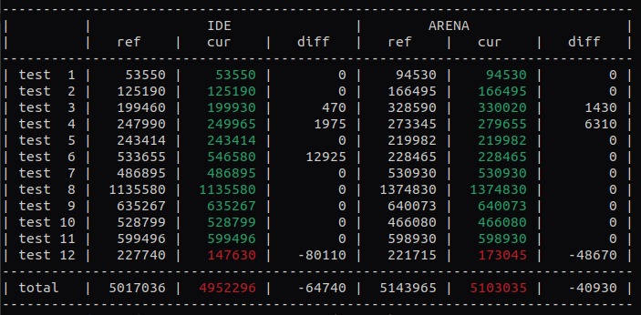

# Codingame FallChallenge 2024 Benchmark
This repository is a fork of [FallChallenge2024-SeleniaCity](https://github.com/CodinGame/FallChallenge2024-SeleniaCity) that adds a Benchmark class to quickly test a solution against all tests cases (IDE and arena).



To build it simply use maven (need java 17):
```sh
mvn package
```

Then it is usable from command line as follow:
```sh
java -jar target/fall-challenge-2024-moon-city-1.0-SNAPSHOT.jar "./myprogram" config/ ref_scores.txt
```
where:
 - `"./myprogram"` is the command used to run your code (obviously here it is for a compiled language, but `"python3 myprogram.py"` should work too)
 - `config/` is the config folder of this repository containing the test cases
 - `ref_scores.txt` is a file containing references score that you want to compare to. for the first run, you can set a non-existing file, and the program will output a `scores.txt` that you can use in next run (rename it to avoid it being overwritten)
